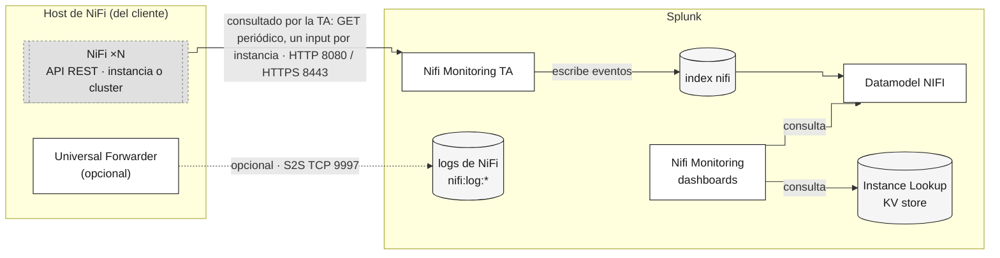
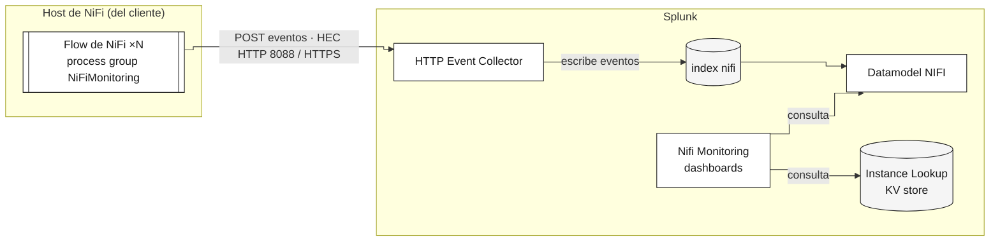

# Compatibilidad y estrategia de recolección

Esta página responde dos preguntas independientes:

1. **¿Qué versiones de NiFi y Splunk soporta esta app?** — [Compatibilidad de versiones](#compatibilidad-de-versiones).
2. **¿Cómo debe llegar la información desde NiFi hasta Splunk?** — [Elegir una estrategia de recolección](#elegir-una-estrategia-de-recoleccion): pull o push, y cuál corresponde a tu entorno.

La estrategia de recolección es independiente de la versión de NiFi:
decídela con los requisitos de abajo, no con la tabla de versiones de
arriba.

## Compatibilidad de versiones

| | Soportado | Probado en CI |
|---|---|---|
| Apache NiFi | 1.16 – 1.28.1, 2.0 – 2.11 | 1.23.2, 1.28.1, 2.0.0, 2.11.0 |
| Splunk Enterprise / Cloud | 9.4 – 10.x | 9.4, 10.4 |

- **NiFi 1.x llegó a su fin de vida el 2024-12-08** (último release: 1.28.1). Sigue funcionando con estas apps, pero las correcciones de seguridad nuevas del proyecto NiFi se publican, de aquí en adelante, únicamente para la línea 2.x.
- **La versión mínima de Splunk es 9.4.** Los dashboards son Dashboard Studio y usan funciones —sparklines en tablas, un input que elige su primer resultado, un clic que fija un token— verificadas en 9.4 y 10.4 y en nada anterior.
- **La versión mínima soportada es NiFi 1.16**, porque el endpoint `/flow/metrics/json` no existe en versiones anteriores. Las instancias 1.x más antiguas siguen funcionando, solo que sin ese endpoint de métricas de flujo; esa combinación no está cubierta por el CI.

## Topología: instancia única, múltiples instancias o cluster

| Topología | Soportado | Qué se configura |
|---|---|---|
| Una instancia | sí | Un input. |
| Varias instancias independientes | sí | Un input por instancia, una fila por instancia en el lookup `instance`. |
| Un cluster de NiFi | sí | **Un input**, apuntado a cualquier nodo. |

Un cluster cuenta como **una sola instancia** para esta app, no como
varias: apunta el input a cualquier nodo, y NiFi responde en nombre de
todo el cluster. El add-on detecta el cluster por su cuenta y recolecta
también los datos por nodo — no hay nada que habilitar.

Los eventos conservan el valor de `host` que configuraste (el nombre del
cluster) y agregan un campo `node` que identifica a qué miembro del
cluster corresponde cada evento. La vista **Cluster** desglosa esto por
miembro, rol y heap por nodo — la vista
agregada por sí sola ocultaría cuál nodo se está quedando sin recursos.

Dos cosas existen solo en un cluster:

- **Los bulletins llevan el nodo que los generó.** Los bulletins de
  framework (categorías como *Clustering* o *Primary Node*) describen al
  cluster mismo, no a un componente, así que no tienen nombre de origen.
- **En la estrategia push, solo el nodo primario consulta la API.** Un
  cluster no envía una copia de los mismos datos por cada nodo. El tail de
  logs sí corre en todos los nodos, porque los archivos de log son por
  nodo, no por cluster. El flow 2.x lo hace solo; el flow 1.x ejecuta todo
  en todos los nodos, y sus fuentes de la API se tienen que poner en
  *Primary node* a mano — ver
  [Estrategia push (1.2)](configuration-push.es.md#3-configura-los-ajustes-del-flow).

## Elegir una estrategia de recolección

Dos formas mutuamente excluyentes llevan los datos de NiFi a Splunk:

- **Pull**: la TA de Splunk consulta la API REST de NiFi en un intervalo
  y escribe lo que recibe. No corre nada dentro de NiFi.
- **Push**: un flow que corre dentro de NiFi llama a la propia API de
  NiFi y envía el resultado al HTTP Event Collector (HEC) de Splunk. Del
  lado de Splunk no hay que alcanzar a NiFi para nada.

**Elige exactamente una por instancia de NiFi — usar las dos en la misma
instancia duplica cada evento.**

### Arquitectura

Qué corre dónde en cada una, y con qué habla cada componente:

#### Pull



Línea sólida = plano de datos · línea punteada = opcional/asíncrono · gris
con borde punteado = componente externo (del cliente) · gris claro =
almacenamiento.

#### Push



Línea sólida = plano de datos · gris con borde punteado = componente
externo (del cliente) · gris claro = almacenamiento. A diferencia de pull,
del lado de Splunk nadie inicia una conexión hacia NiFi — el flow empuja.

### Cuál usar

**Usa pull, a menos que se cumplan las dos condiciones siguientes:**

1. Splunk realmente no puede alcanzar la API de NiFi — NiFi está en una
   DMZ, o en una red que solo permite conexiones salientes desde él.
2. Tu NiFi **no tiene ninguna autenticación habilitada**. Push llama a
   la propia API de NiFi sin enviar ninguna credencial. Si NiFi exige
   login (single-user, LDAP, o cualquier otro), esa llamada falla con
   401, y no hay ningún ajuste que lo resuelva — el flow nunca fue
   diseñado para autenticarse.

Si alguna de esas dos condiciones no se cumple en tu entorno, usa pull:
es la opción por defecto, funciona con o sin autenticación en NiFi, y no
requiere instalar nada dentro de NiFi.

| | Pull | Push |
|---|---|---|
| Dirección de red requerida | Splunk → NiFi | NiFi → Splunk |
| Autenticación de NiFi soportada | Ninguna, single-user o LDAP | **Únicamente ninguna** |
| Qué se instala dentro de NiFi | Nada | Un process group (37 procesadores), 3 reporting tasks, 2 puertos de entrada Site-to-Site; un archivo de flow distinto por versión mayor de NiFi |

### Comparación de funcionalidades

| | Pull | Push |
|---|---|---|
| Flow status, diagnostics, status history | sí | sí |
| Flow metrics (`/flow/metrics`) | sí | no |
| [Endpoints personalizados](configuration-pull.es.md#endpoints-personalizados) (cualquier otra ruta REST) | sí | no |
| Endpoints elegidos según la versión de NiFi | sí | no |
| Bulletins individuales | sí, por polling | sí, sin pérdida |
| `bulletinGroupName` / `bulletinGroupPath` | no | sí |
| Archivos de log de NiFi | vía Universal Forwarder (ver abajo) | app, bootstrap y user vía el flow; request y deprecation solo vía Universal Forwarder |

Los bulletins son el único punto donde push es realmente mejor: una
reporting task envía cada bulletin en el momento en que ocurre, mientras
que el polling lee un tablero que solo conserva una ventana corta de
tiempo — un intervalo más largo que esa ventana pierde eventos. El input
registra una advertencia cuando un poll vuelve lleno, que es la señal de
que esto está pasando.

## Recolectar los archivos de log de NiFi

Independiente de pull o push: ambas estrategias *pueden* recolectar los
archivos de log de NiFi, pero la recomendación no es ninguna de las dos.
**Usa un Universal Forwarder en el host de NiFi.** La TA ya trae los
monitor inputs para esto, desactivados por defecto — activa los que
necesites y corrige la ruta.

Un forwarder maneja la rotación de logs y mantiene su propio checkpoint,
y si Splunk queda inalcanzable encola en disco en lugar de generar
presión sobre el mismo flow que NiFi usa para su trabajo real.

`TailFile` dentro del flow envía solo `nifi-app.log`, `nifi-bootstrap.log`
y `nifi-user.log`: los logs de request y deprecation, que lee la vista
**Logs**, necesitan el forwarder. Sigue soportado para cuando un forwarder no es
una opción — por ejemplo, NiFi corriendo en un contenedor al que no se le
puede agregar un sidecar.

La TA define cinco sourcetypes de log. Activa `nifi:log:deprecation`
antes de migrar a NiFi 2.x: registra qué componentes deprecados sigue
usando la instancia.

### Configurar el Universal Forwarder

1. **Instala un Universal Forwarder en el host de NiFi.** Instalación
    estándar de Splunk — ver la
    [documentación oficial del Universal Forwarder](https://docs.splunk.com/Documentation/Forwarder)
    si no lo hiciste antes.

2. **Instala `nifi_TA_monitoring` en ese mismo forwarder** — el mismo
    paquete que instalaste en el indexer/search head, no uno distinto.
    Cópialo dentro de `$SPLUNK_HOME/etc/apps/` del forwarder, o distribúyelo
    por un deployment server si administras el forwarder de esa forma.

3. **Activa los monitores de log que necesites y confirma la ruta.** No
    edites el `default/inputs.conf` de la TA — pon los cambios en
    `$SPLUNK_HOME/etc/apps/nifi_TA_monitoring/local/inputs.conf` (crea el
    archivo si no existe todavía), y pon `disabled = false` en cada
    monitor que quieras, por ejemplo:

    ```
    [monitor:///opt/nifi/nifi-current/logs/nifi-app*.log]
    disabled = false
    sourcetype = nifi:log:app
    index = nifi

    [monitor:///opt/nifi/nifi-current/logs/nifi-deprecation*.log]
    disabled = false
    sourcetype = nifi:log:deprecation
    index = nifi

    [monitor:///opt/nifi/nifi-current/logs/nifi-user*.log]
    disabled = false
    sourcetype = nifi:log:user
    index = nifi

    [monitor:///opt/nifi/nifi-current/logs/nifi-bootstrap*.log]
    disabled = false
    sourcetype = nifi:log:bootstrap
    index = nifi

    [monitor:///opt/nifi/nifi-current/logs/nifi-request*.log]
    disabled = false
    sourcetype = nifi:log:request
    index = nifi
    ```

    Son los cinco sourcetypes que define la TA. Comenta o borra el stanza
    de cualquiera que no necesites.

    La ruta de arriba coincide con la imagen oficial del contenedor de
    NiFi. Una instalación por paquete guarda los logs donde apunte
    `NIFI_HOME` en cambio — revisa `nifi.properties`
    (`org.apache.nifi.bootstrap.ConfigurableLogging`) o busca directamente
    `nifi-app.log` en disco, y corrige la ruta `monitor://` en cada
    stanza que actives si es distinta.

4. **Apunta el forwarder al indexer.** En
    `$SPLUNK_HOME/etc/system/local/outputs.conf`:

    ```
    [tcpout]
    defaultGroup = default-autolb-group

    [tcpout:default-autolb-group]
    server = <host-del-indexer>:9997
    ```

    El indexer también necesita tener la recepción habilitada en el
    9997 — **Settings > Forwarding and receiving > Configure receiving >
    New Receiving Port** si todavía no lo está.

5. **Reinicia el forwarder**: `$SPLUNK_HOME/bin/splunk restart`.

6. **Verifica desde el indexer o el search head**:

    ```
    index=* sourcetype=nifi:log:* | stats count by sourcetype
    ```

    Un sourcetype en cero puede ser porque todavía no tiene nada que
    registrar (`nifi:log:deprecation` en una instancia tranquila, por
    ejemplo) o porque la ruta sigue mal — revisa el paso 3 de nuevo antes
    de asumir que el forwarder en sí está roto.
