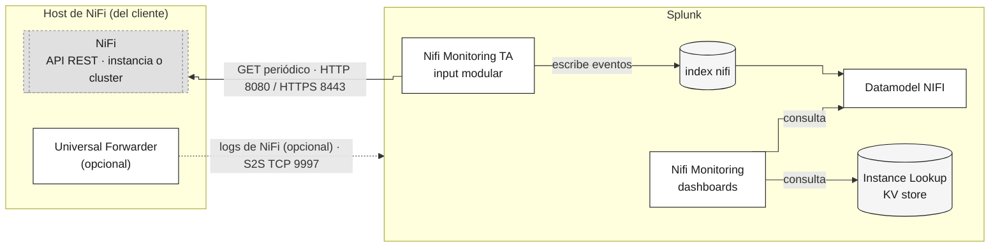

# Instalación y Configuración v2.0.0

Guía paso a paso del lado de Splunk, desde las apps ya instaladas hasta
los dashboards con datos. Esta página asume la estrategia **pull** (el TA
consultando la API REST de NiFi) — la opción por defecto y recomendada.
Para **push**, ver [Estrategia push: Envío Directo](configuration-push.es.md)
en su lugar.

¿No sabes qué estrategia necesitas? Revisa
[Elegir una estrategia de recolección](compatibility.es.md#elegir-una-estrategia-de-recoleccion)
antes de empezar.

**Requisito**: las cuatro apps instaladas — ver
[Instalar NIFI Monitoring](installation.es.md).

## Arquitectura

Línea sólida = plano de datos · línea punteada = opcional/asíncrono · gris
con borde punteado = componente externo (del cliente) · gris claro =
almacenamiento.

## 1. Crear el input de la TA

Ve a **Apps > NiFi TA Monitoring > Inputs**.

Haz clic en **Create New Input**. Un input cubre una instancia completa de
NiFi, o un cluster completo apuntando a cualquier nodo — ver
[Topología](compatibility.es.md#topologia-instancia-unica-multiples-instancias-o-cluster).
Crea uno por cada instancia que monitorees.

Completa, como mínimo:

- **NiFi instance name** — un nombre único, usado como valor de `host` en
  cada evento de este input.
- **NiFi API URL** — ej. `https://<dirección>:<puerto>/nifi-api/`.
- **Authentication** — `None`, o `Username and password` si NiFi tiene
  autenticación básica habilitada. Usa **Test connection** para probar las
  credenciales antes de guardar.
- **TLS** (sección colapsada, solo importa sobre HTTPS) — deja **Verify the
  TLS certificate** activado a menos que el certificado de NiFi no se pueda
  confiar mediante un CA bundle. Si es autofirmado, consíguelo y apunta
  **CA bundle path** ahí — ver
  [Cómo conseguir un certificado para el CA bundle](configuration-pull.es.md#como-conseguir-un-certificado-para-el-ca-bundle).

Después, en **Advanced**, configura:

- **Index** — `nifi`, no el valor por defecto. La app trae un índice
  dedicado `nifi` (`nifi_monitoring/default/indexes.conf`), y todos los
  dashboards leen a través de la macro `index_nifi`, que apunta a
  `index=nifi` por defecto. Dejar este campo en su valor por defecto rompe
  todos los paneles.

Deja el resto de las secciones (Endpoints, Status History, Flow metrics,
Custom endpoints) en su valor por defecto para una primera
configuración — ver
[Estrategia pull: Splunk Data Input NiFi](configuration-pull.es.md) para
qué hace cada una.

Haz clic en **Add** para registrar el input. Ahora aparece como una fila
en **Inputs**:

Repite para cada instancia de NiFi que quieras monitorear.

## 2. Configurar el Instance Lookup

Igual para cualquier versión — ver
[Lookup de Instancias](instance-lookup.es.md).

Después, ve a **Nifi Monitor Overview**, en la app **Nifi Monitoring**, y
comprueba que la configuración quedó bien:

## 3. (Opcional) Recolectar los archivos de log de NiFi

Con los pasos anteriores ya tienes estado del flujo, diagnóstico y
bulletins. Los archivos de log en texto que NiFi escribe en disco
(`nifi-app.log` y el resto) son una fuente de datos aparte, y opcional:
para traerlos hace falta instalar un Universal Forwarder en el host de
NiFi y apuntarlo a tu indexer. El procedimiento completo, paso a paso,
está en [Configurar el Universal Forwarder](compatibility.es.md#configurar-el-universal-forwarder).

## 4. (Opcional) Acelerar el datamodel

Los dashboards funcionan igual sin este paso: si el datamodel no está
acelerado, `tstats` simplemente hace una búsqueda normal sobre los eventos
en lugar de leer un resumen ya calculado. Activar la aceleración es lo más
efectivo para que los paneles carguen más rápido, pero tiene un costo:
Splunk mantiene aparte un índice de resumen que ocupa espacio en disco.

1. Ve a **Settings > Data models > NIFI > Edit > Edit Acceleration**.
2. Marca **Accelerate** y elige un rango de resumen. La app está diseñada
   para `-7d`, que es el valor recomendado.

## Siguiente paso

- Tu estrategia de recolección tiene campos que no cubre esta página
  (custom endpoints, flow metrics, sourcetypes de log):
  [Estrategia pull](configuration-pull.es.md) /
  [Estrategia push](configuration-push.es.md).
- Referencia de sourcetypes y campos:
  [Referencia de Datos](references.es.md).
